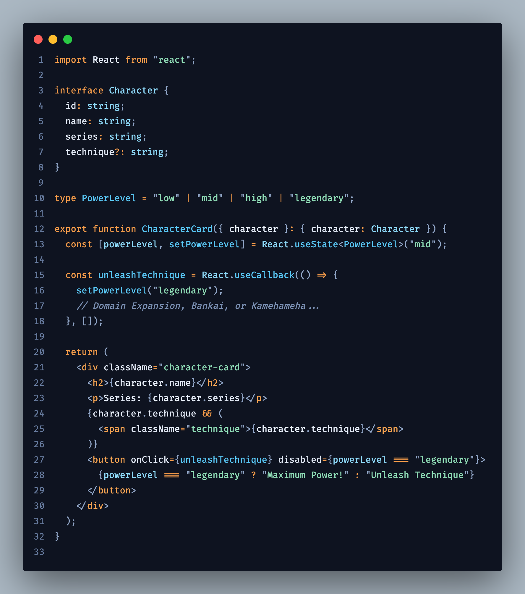
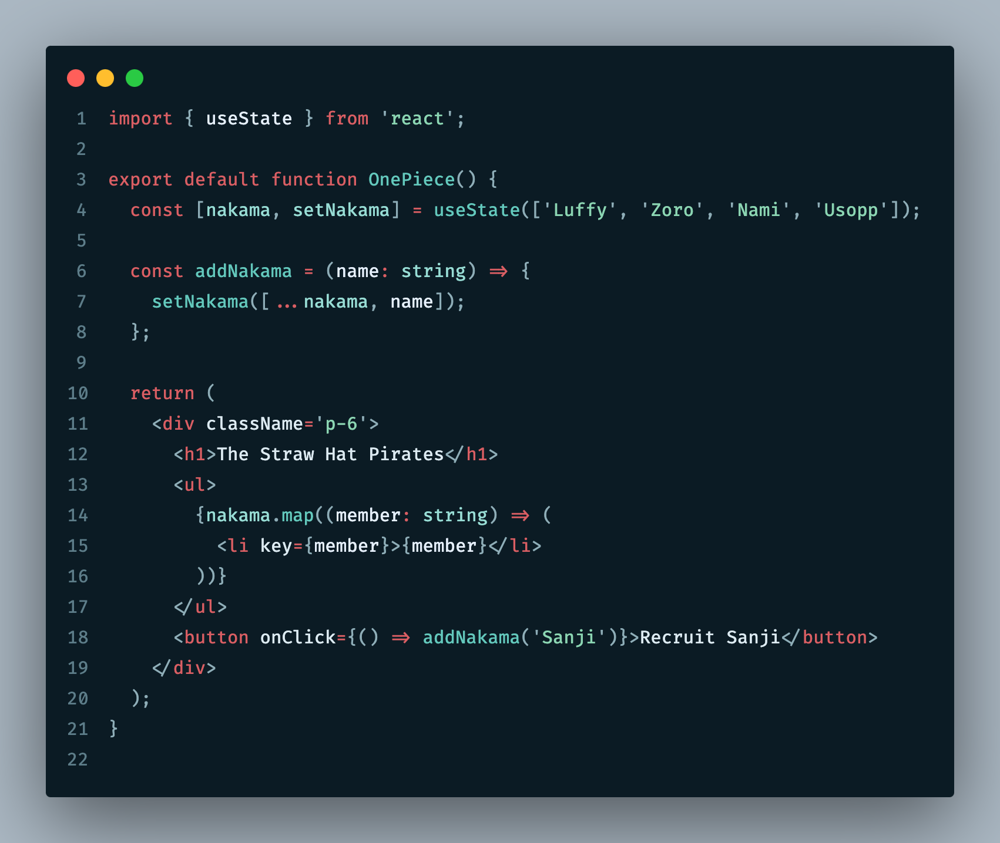
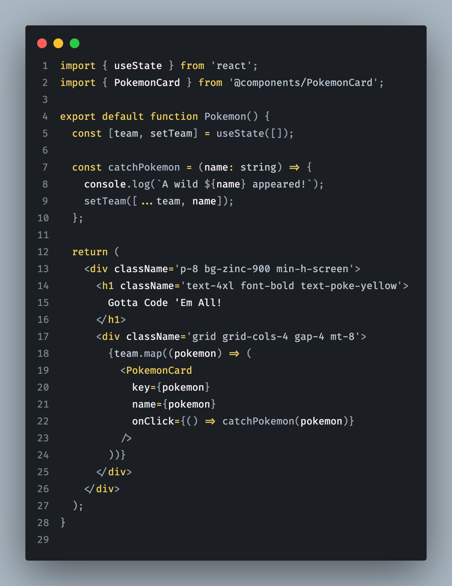
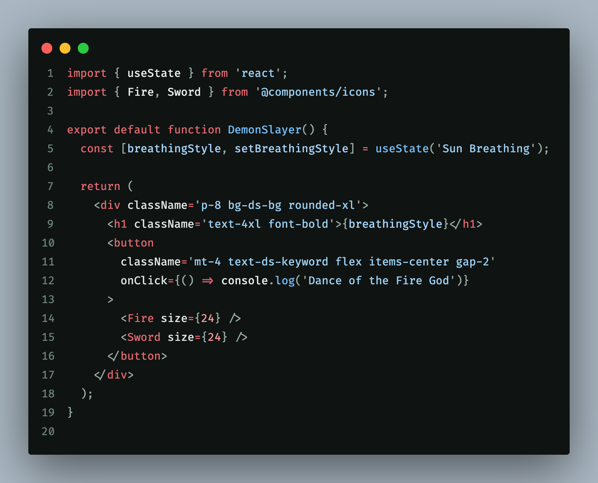
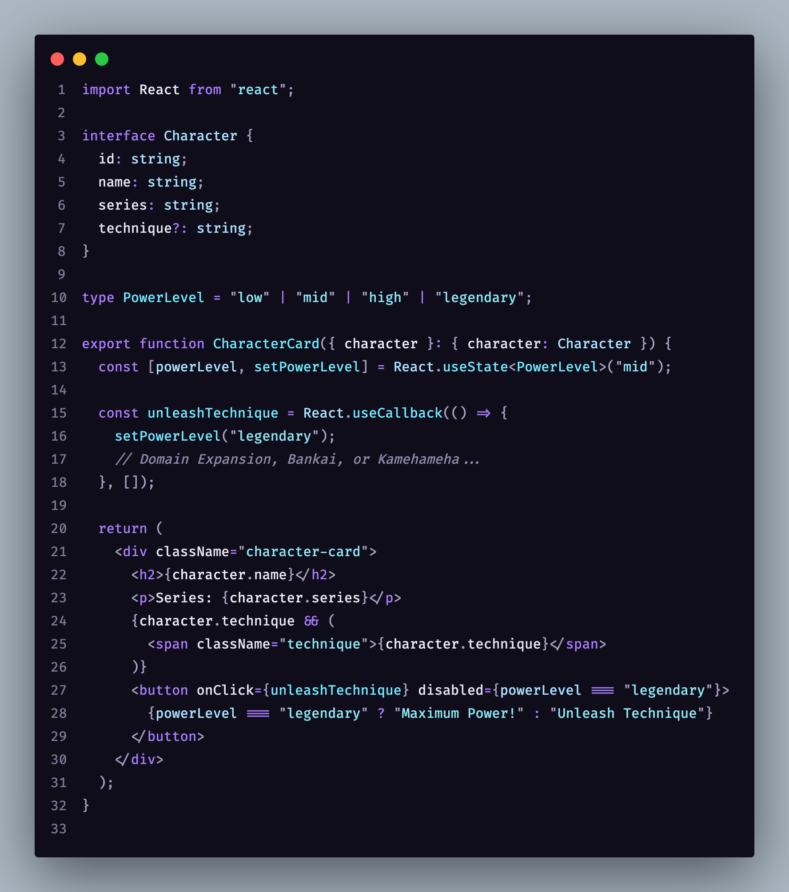
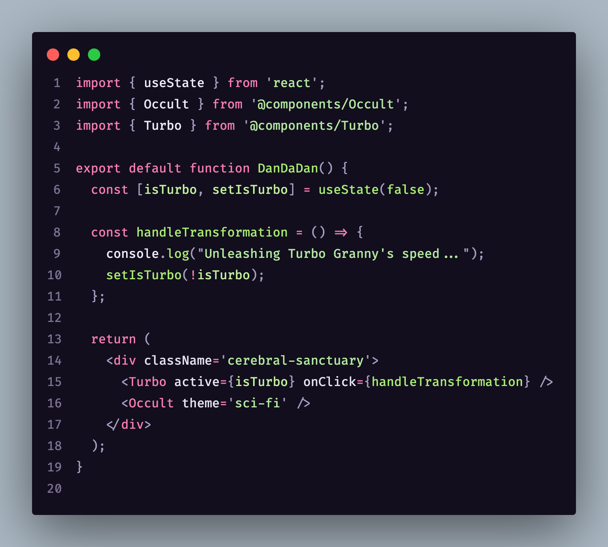

# MangaMode: anime & manga eye-comfort themes

[](https://marketplace.visualstudio.com/items?itemName=markonikolajevic.mangamode) [](https://github.com/MarkoNikolajevic/manga-mode-theme/blob/main/LICENSE)

A VS Code theme extension with anime/manga-inspired dark variants for long coding sessions level up your setup without frying your eyes:

- Low-glare backgrounds for marathon coding
- Controlled saturation-vibrant but not overwhelming
- Clear token contrast without harsh neon, so your syntax stays readable

## Theme variants

Expand **Preview** under a variant to see it in the editor.

**Dragon Ball:** A high-energy theme with bold oranges and deep blues. Designed for those "Power Level over 9000" coding sessions

<details>
<summary>Preview</summary>



</details>

<br>
<br>

**One Piece:** Rich ocean teals and Straw Hat reds. Navigate through your most complex codebases like a Pirate King

<details>
<summary>Preview</summary>



</details>

<br>
<br>

**Pokémon:** Sharp yellows and soft greys. Fast, recognizable, and "super effective" against eye strain

<details>
<summary>Preview</summary>



</details>

<br>
<br>

**Demon Slayer:** Deep charcoal backgrounds with striking water-blue and fire-red accents. Elegant and sharp as Nichirin sword

<details>
<summary>Preview</summary>



</details>

<br>
<br>

**Jujutsu Kaisen:** A "Hollow Purple" aesthetic featuring dark violets and neon cyans. Master the domain of your own logic

<details>
<summary>Preview</summary>



</details>

<br>
<br>

**Dandadan:** A chaotic-cool mix of neon pinks, extraterrestrial greens, and occult purples. For the dev who likes things a bit weird

<details>
<summary>Preview</summary>



</details>

<br>
<br>

## Installation

### From the Visual Studio Code Marketplace (recommended)

1. In VS Code, open the **Extensions** view: `Ctrl+Shift+X` (Windows/Linux) or `Cmd+Shift+X` (macOS).
2. Search for **MangaMode**, or paste the extension ID `markonikolajevic.mangamode` into the search box.
3. Open the **MangaMode** result and click **Install**.

### From a `.vsix` file (manual)

1. Download the `.vsix` from the [Releases](https://github.com/MarkoNikolajevic/manga-mode-theme/releases) page.
2. In VS Code, open the Command Palette (`Ctrl+Shift+P` / `Cmd+Shift+P`).
3. Run **Extensions: Install from VSIX...**.
4. Choose the downloaded file.

## Usage

1. Open Command Palette: `Ctrl+Shift+P` (Windows/Linux) or `Cmd+Shift+P` (macOS)
2. Run **Preferences: Color Theme**
3. Select any `MangaMode: ...` variant

## Suggested settings for eye strain & eye health

Pair this theme with these VS Code settings to reduce eye fatigue during long coding sessions. Merge these keys into your `settings.json` (File → Preferences → Open User Settings (JSON)):

```json
{
  "editor.fontSize": 15,
  "editor.fontFamily": "'Fira Code', 'JetBrains Mono', 'Cascadia Code', monospace",
  "editor.fontLigatures": true,
  "editor.lineHeight": 1.6,
  "editor.cursorBlinking": "smooth",
  "editor.cursorSmoothCaretAnimation": "on",
  "editor.smoothScrolling": true,
  "editor.minimap.enabled": true,
  "editor.minimap.scale": 1,
  "editor.bracketPairColorization.enabled": true,
  "editor.guides.bracketPairs": true
}
```

**Tip:** Take regular breaks (e.g. 20-20-20 rule: every 20 minutes, look at something 20 feet away for 20 seconds).

## Feedback

Found a bug, have a theme idea, or just want to say hi? Drop a line at [marko@frompixels.com](mailto:marko@frompixels.com) - your feedback powers the next arc of MangaMode.

## License

MIT © [Marko Nikolajevic](https://github.com/MarkoNikolajevic)

<br />
<br />
<br />

Crafted with ❤️, AI, and a love for anime by [Marko Nikolajevic](https://markonikolajevic.dev)
